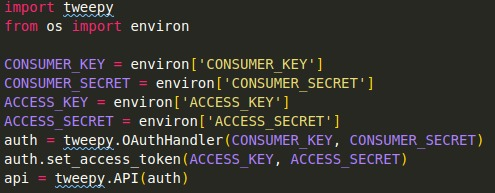

# Tea Bot for Twitter

Tea bot for Twitter is a bot made in Python, with the <a href="https://www.tweepy.org/">Tweepy</a> library, that searches the Twitter for tea related tweets and retweets the ones with more retweets.

## How it works?

First you need to setup the keys for the Twitter API. Here I used environ, from the os library, to set this up as environment variables, since I don't want anyone to get these keys.

