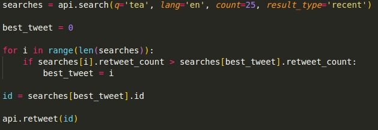

# Tea Bot for Twitter

Tea bot for Twitter is a bot made in Python, with the <a href="https://www.tweepy.org/">Tweepy</a> library, that searches the Twitter for tea related tweets and retweets the ones with more retweets.

## How it works?

First you need to setup the keys for the Twitter API. Here I used environ, from the os library, to set this up as environment variables, since I don't want anyone to get these keys.

After that, I set an search query with the term that I wanted to use as a base, a language, how many posts I want the app to collect, and the result types that I want.

With that search, I programmed a for loop to get the id of the tweet that received the most retweets. Finishing it, I ordered the script to retweet the tweet that was gotten on the for loop.

